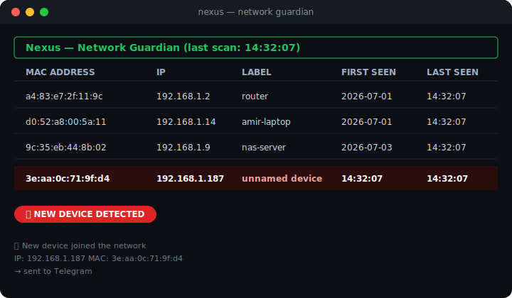

<div align="center">


</div>

## What it does

Nexus watches every device connected to your network. It scans continuously, keeps a registry of everything it's seen before, and the moment a device it **doesn't recognize** shows up — a phone that isn't yours, a laptop that shouldn't be there, anything — it flags it live in a terminal dashboard and pings you on Telegram.

This is the same core idea behind rogue-device detection in real network security tooling, just built from scratch and small enough to actually read end to end.

## See it in action

<div align="center">

</div>

<p align="center"><i>known devices sit quiet in the table — an unrecognized one lights up red and triggers an alert</i></p>

## How it works

```
┌───────────────┐      ┌────────────────────┐      ┌───────────────────┐
│  ARP Scan     │────▶ │  Registry Diff     │────▶│  Live Dashboard   │
│  (scapy)      │      │  (known_devices    │      │  (rich TUI)       │
│               │      │   .json)           │      │                   │
└───────────────┘      └────────────────────┘      └───────────────────┘
                                │
                                ▼
                     ┌────────────────────┐
                     │  New device found? │
                     │  → Telegram alert  │
                     └────────────────────┘
```

1. Every `SCAN_INTERVAL_SECONDS`, Nexus sends an ARP broadcast across your subnet and collects every device that answers
2. Each device's MAC address gets checked against `known_devices.json` — the local registry of everything seen before
3. Anything new gets added to the registry, drawn in red on the dashboard, and pushed to Telegram
4. Devices already known just get their `last_seen` timestamp updated, quietly, no alert

MAC addresses are the anchor here, not IPs — IPs shift around with DHCP, MACs (mostly) don't.

## Setup

```bash
git clone https://github.com/Amirzamani1l/nexus.git
cd nexus
pip install -r requirements.txt
```

ARP scanning needs raw socket access, so it has to run with elevated privileges:

```bash
sudo python main.py        # Linux / macOS
```

On Windows, install [Npcap](https://npcap.com/) first (scapy needs it for packet-level access), then run your terminal as Administrator.

Set your Telegram bot token and chat id as environment variables if you want alerts:

```bash
export TELEGRAM_BOT_TOKEN="your_bot_token"
export TELEGRAM_CHAT_ID="your_chat_id"
```

Don't have a bot yet? Message [@BotFather](https://t.me/BotFather) on Telegram, run `/newbot`, done in under a minute.

## Run

```bash
sudo python main.py
```

Press `Ctrl+C` to stop. The dashboard redraws itself on every scan cycle.

## Configuration

| Setting | What it controls |
|---|---|
| `NETWORK_RANGE` | subnet to scan, e.g. `192.168.1.0/24` — leave blank to auto-detect |
| `SCAN_INTERVAL_SECONDS` | how often Nexus re-scans the network |
| `KNOWN_DEVICES_FILE` | where the device registry gets saved |

## Project structure

```
nexus/
├── main.py            entry point, scan loop
├── scanner.py          ARP scanning logic
├── registry.py         known-device tracking + diffing
├── dashboard.py         live terminal UI
├── notifier.py          Telegram alerts
└── config.py            settings
```

## Notes

- Only sees devices on the same local subnet — it can't see across VLANs or through a router into another network
- The first scan will flag *every* device as "new" since the registry starts empty — that's expected, not a bug
- Renaming a device is manual for now: open `known_devices.json` and edit the `"label"` field for any MAC you recognize
- Runs great on a Raspberry Pi sitting on your network 24/7, which is honestly the best way to use it

## License

MIT — do whatever you want with it.
